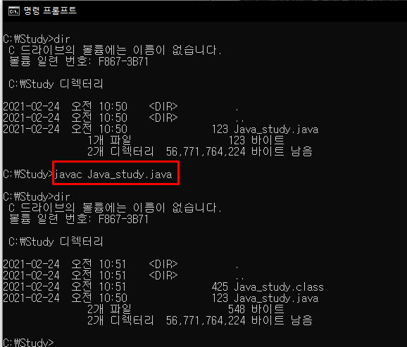

# 목표

> 자바 소스 파일(.java)을 JVM으로 실행하는 과정 이해하기.

---

## 학습할 것

- JVM이란 무엇인가
- 컴파일 하는 방법
- 실행하는 방법
- 바이트코드란 무엇인가
- JIT 컴파일러란 무엇이며 어떻게 동작하나
- JVM 구성 요소
- JDK와 JRE의 차이

---

# 1. JVM은 무엇이며, 자바 코드는 어떻게 실행하는 것인가?
---

## 1. JVM이란 무엇인가
---

> 자바 가상 머신. 자바 바이트 코드(.class)를 OS에 특화된 코드로 변환(인터프리터와 JIT)하여 실행

JVM은 플랫폼(예로 운영체제) 독립적으로, JVM이 실행 가능한 환경이라면 어디서든 자바 프로그램을 실행 가능하도록 함.

## 2. 컴파일 하는 방법
---
> javac <options> <source file>
### Java 코드

```java
public class Java_study {
    public static void main(String[] ar) {
        System.out.println("Hello, JAVA");
    }
}
```

### 컴파일 후 결과



## 3. 실행하는 방법
---
> java <class file>


> JAVA 하위 버전에서 컴파일 하여 상위 버전에서 실행 시 실행 O, JAVA 상위 버전에서 컴파일 하여 하위 버전에서 실행 시 실행 X (컴파일 옵션에 따라 실행 가능)

## 4. 바이트코드란 무엇인가
---
> 바이트코드는 특정 하드웨어가 아닌 가상 컴퓨터에서 돌아가는 실행 프로그램을 위한 이진 표현

자바에서 바이트코드는 JVM이 실행하는 명령어 형태이다. 자바 문법으로 작성한 자바파일(.java)은 사람은 이해할 수 있지만 컴퓨터는 이해 불가능 하다.

그래서 컴퓨터가 이해할 수 있도록 컴파일 하여 클래스파일(.class) 을 만들고 JVM이 바이트코드를 실행한다.

### 바이트코드 확인법

> java -c 클래스파일명


## 5. JIT 컴파일러란 무엇이며 어떻게 동작하나
---
JIT(Just In Time) 컴파일러는 프로그램을 실행하는 시점에 바이트코드를 기계어로 번역하는 컴파일 기법이다.

프로그램 실행 시점에 인터프리터 방식으로 기계어 코드를 생성하고 그 코드를 캐싱하여, 동일 함수가 여러 번 호출될 때 매번 기계어 코드를 생성하는 것을 방지한다.

자바에서는 자바 컴파일러가 자바 파일(.java)을 바이트코드(.class)로 변환하고, 실제 바이트코드가 실행될 때 JVM이 바이트코드를 JIT을 통해 기계어로 변환한다.

## 6. JVM 구성 요소
---
### JVM 구조


### 클래스 로더 시스템

- 로딩: 클래스(.class)를 읽어오는 과정
- 링크: 레퍼런스를 연결하는 과정
- 초기화: static 값들 초기화 및 변수에 할당

### 메모리

- 메소드 영억: 클래스 수준의 정보 저장 (클래스 이름, 풀 패키지 경로, 부모 클래스 이름, 메소드, 변수), 다른 영역에서 참조 할 수 있는 영역 (공유하는 자원)
- 힙 영역: 객체를 저장 (공유하는 자원)
- 스택 영역: 쓰레드 마다 런타임 스택을 만들고, 그 안에 스택 프레임(메소드 호출)을 쌓음 (쓰레드 종료 시 런타임 스택도 사라짐)
- PC(Program Counter) 레지스터 영역: 쓰레드 마다 쓰레드 내 현재 실행할 스택 프레임을 가르키는 포인터가 생성
- 네이티브 메소드 스택: 쓰레드 마다 생기며, 네이티브 메소드 호출할때 사용되는 별도의 메소드 스택

### 실행 엔진

- 인터프리터: 바이트 코드를 한줄 씩 네이티브 코드로 변경하여 실행
- JIT 컴파일러: 인터프리터에서 반복되는 코드 발견시 JIT 컴파일러로 반복되는 코드를 모두 네이티브 코드로 변경해 둠
- GC(Garbage Collector): 더이상 참조하지 않는 객체를 모아서 정리

### JNI(Java Native Interface)

- 자바 애플리케이션에서 C, C++, 어셈블리어로 작성된 함수를 사용할 수 있는 인터페이스 제공
- Native 키워드를 사용한 메소드 호출

## 6. JDK와 JRE의 차이
---
### JRE (Java Runtime Environment)

> JVM과 핵심 라이브러리 및 자바 런타임 환경에서 사용하는 프로퍼티 세팅이나 리소스 파일로 구성된 배포판 (실행하기 위한 환경 O / 개발하기 위한 환경 X)

### JDK (Java Development Kit)

> JRE + 개발에 필요한 툴 (대표적으로 javac 포함)