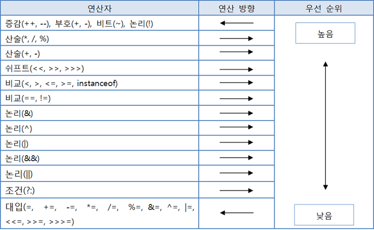

# 목표

> 자바가 제공하는 다양한 연산자를 학습하세요.

---

## 학습할 것

- 산술 연산자
- 비트 연산자
- 관계 연산자
- 논리 연산자
- instanceof
- assignment(=) operator
- 화살표(->) 연산자
- 3항 연산자
- 연산자 우선 순위
- (optional) Java 13. switch 연산자

---

# 1. 산술 연산자
---

> 일반적인 덧셈, 뺄셈, 곱셈, 나눗셈 사칙 연산을 뜻함. 자바에서는 사칙연산과 나머지 연산(%)을 뜻함

## 예시

```java
public class Java_Study_3 {
    public static void main(String[] args) {
        int a = 20;
        int b = 8;

        System.out.println(a + b);
        System.out.println(a - b);
        System.out.println(a * b);
        System.out.println(a / b);
        System.out.println(a % b);
    }
}
```

## Output

```
28
12
160
2
4
```

결과를 보면 나눗셈을 하면 소수점이 나와야하는데 정수만 출력되었다. 그 이유는 정수형 자료형을 사용해서 연산을 했기 때문에 정수 표현 범위 내에서만 결과가 출력된다.

# 2. 비트 연산자
---

> 비트 연산은 1과 0을 가지고 연산을 하며 일반적으로 0은 false, 1은 true를 상징

- ~(NOT) : 단항 연산을 함. 비트를 반전
- &(AND) : 이항 연산을 함. 둘 다 true인 경우 true를 반환
- |(OR) : 이항 연산을 함. 둘 중 하나라도 true인 경우 true를 반환
- ^(XOR) : 이항 연산을 함. 서로 다른 경우 true를 반환

## 예시

```java
public class Java_Study_3 {
    public static void main(String[] args) {
        int a = 3;
        int b = 8;

        System.out.println(~a);
        System.out.println(a & b);
        System.out.println(a | b);
        System.out.println(a ^ b);
    }
}
```

## Output

```
-4
0
11
11
```

# 3. 관계 연산자
---

> 연산자를 중심으로 양쪽 값이 어떤 관계를 갖는지 확인하는 연산

- == : 양쪽 값이 같으면 참, 다르면 거짓
- != : 양쪽 값이 다르면 참, 같으면 거짓
- > : 왼쪽 값이 크면 참, 같거나 작으면 거짓
- >= : 왼쪽 값이 크거나 같으면 참, 작으면 거짓
- < : 왼쪽 값이 작으면 참, 크거나 같으면 거짓
- <= : 왼쪽 값이 작거나 같으면 참, 크면 거짓
- instanceof : 왼쪽 참조 변수가 오른쪽 참조 변수 타입과 같으면 참, 아니면 거짓

# 4. 논리 연산자
---

> 비트 연산과 비슷하지만 대상이 boolean 타입의 논리 값

```java
public class Java_Study_3 {
    public static void main(String[] args) {
        boolean a = true;
        boolean b = false;
        boolean c = true;

        System.out.println(a && b); // 양쪽다 true 일 때 true, 아니면 false
        System.out.println(a && c);
        
        System.out.println(a || b); // 양쪽 중 하나라도 true 일 때 true, 아니면 false
        System.out.println(a || c);
    }
}
```

# 5. instanceof
---

> 객체가 특정 클래스 혹은 인터페이스 유형인지 확인

```java
class TestA {}
class TestB extends TestC {}
class TestC implements TestI {}
interface TestI {}

public class Java_Study_3 {
    public static void main(String[] args) {
        TestA a = new TestA();
        TestB b = new TestB();
        TestC c = new TestC();

        System.out.println(a instanceof TestI);
        System.out.println(b instanceof TestI);
        System.out.println(c instanceof TestI);
    }
}
```

# 6. assignment(=) operator
---

> 대입 연산자라고도 하며, 변수에 값을 대입할 때 사용

## 예시

```java
public class Java_Study_3 {
    public static void main(String[] args) {
        int a = 10;
        int b = 11;

        a += 5;
        b *= 10;

        System.out.println(a);
        System.out.println(b);
    }
}
```

## Output

```
15
110
```

# 7. 화살표(->) 연산자
---

> 자바 8부터 지원하는 람다식을 사용할 때 사용하는 연산자

```java
@FunctionalInterface
interface Compare {
    int max(int a, int b);
}

public class Java_Study_3 {
    public static void main(String[] args) {
        Compare fuc = (int a, int b)-> {
            return (a > b) ? a : b;
        };

        System.out.println(fuc.max(10, 2));
    }
}
```

# 8. 3항 연산자
---

> 조건식 ? 반환값 A : 반환값 B

자바에서 유일하게 피연산자를 세 개나 가지는 조건 연산자.

조건식이 true이면 반환값 A를 반환, false이면 반환값 B를 반환

# 9. 연산자 우선 순위
---



출처 : https://medium.com/@katekim720/%EC%97%B0%EC%82%B0%EC%9E%90%EB%B6%80%ED%84%B0-%EC%A1%B0%EA%B1%B4-%EB%B0%98%EB%B3%B5%EB%AC%B8%EA%B9%8C%EC%A7%80-3d5cec6513d4

# 10. (optional) Java 13. switch 연산자
---

## case에 여러개의 케이스를 담을수 있다.

```java
public class Java_Study_3 {
    public static void main(String[] args) {
        int a = 1;
        switch(a) {
            case 2, 4, 6 -> System.out.println("짝수");
            case 1, 2, 3 -> System.out.println("홀수");
        }
    }
}
```

## switch에서 값을 리턴할 수 있다.

```java
public class Java_Study_3 {
    public static void main(String[] args) {
        int a = 1;

        boolean result = switch(a) {
            case 2, 4, 6 -> true;
            case 1, 2, 3 -> false;
        }
    }
}
```

## 명시적 리턴을 하기 위해 yield 키워드 추가

```java
public class Java_Study_3 {
    public static void main(String[] args) {
        int a = 1;

        boolean result = switch(a) {
            case 2 :
                yield true;
            case 1 :
                yield false;
        }
    }
}
```